# Assignment #3: Responsive Web Design (Media Queries and Bootstrap Grid)

**Name:** Avirup Roy

**Group:** IT-2513

**Live Site:** https://aviruproyneal.github.io/assignment3_webtech/#portfolio

---

## Objective

This assignment was about making a webpage that adapts to different screen sizes. I used CSS media queries for the first half and Bootstrap's 12-column grid for the second half, then combined both in the final portfolio page.

---

## Part 1: Media Queries

### Task 0: Responsive Typography

I set up base font sizes for mobile and used `min-width` media queries at 768px and 992px to scale up `h1`, `h2`, and `p` at each breakpoint. Mobile gets the smallest text, tablet is medium, desktop is largest.

**Screenshot:**

**Screenshot (desktop):**

**Screenshot (mobile):**
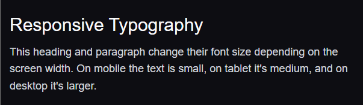

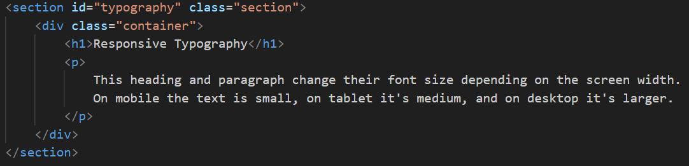
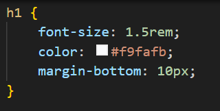
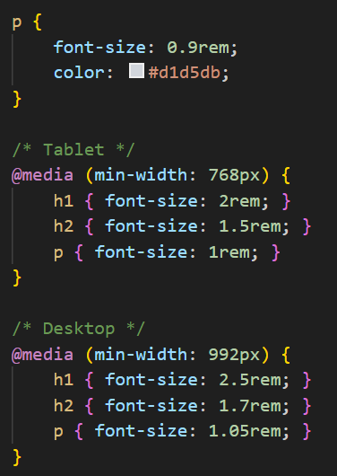

### Task 1: Responsive Layout with Media Queries

Three boxes inside a flex container. The container has `flex-wrap: wrap` and the boxes use `flex-basis` values that change with media queries: `100%` on mobile (stacked), `45%` on tablet (2 per row), and `30%` on desktop (3 per row). No Bootstrap used here.

**Screenshot (desktop):**
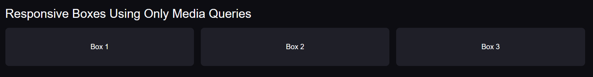

**Screenshot (tablet):**
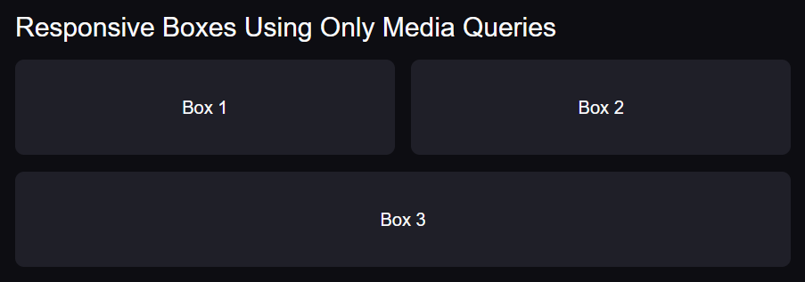

**Screenshot (mobile):**
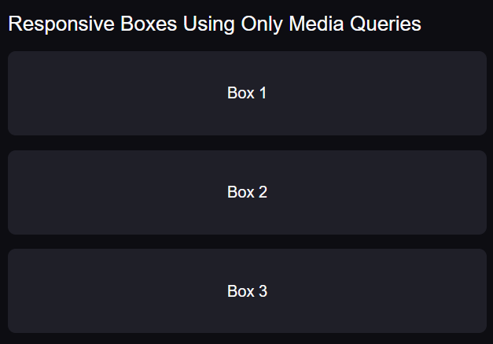

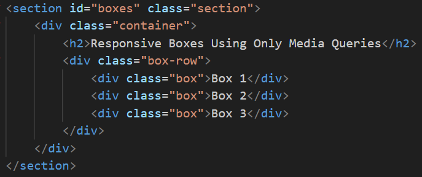
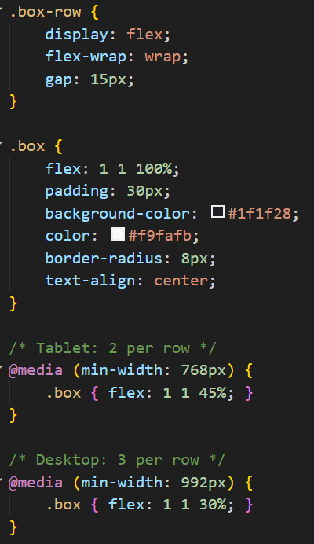

---

## Part 2: Bootstrap Grid System

### Task 2: Bootstrap Responsive Columns

Three columns in a Bootstrap row using `col-lg-4` and `col-md-6`. On desktop each takes 4 of 12 columns (so three fit in a row). On tablet the first two take 6 columns each (so they share a row) and the third takes 12 (so it drops to the next row). On mobile they all default to 12 and stack.

**Screenshot (desktop):**

**Screenshot (tablet):**
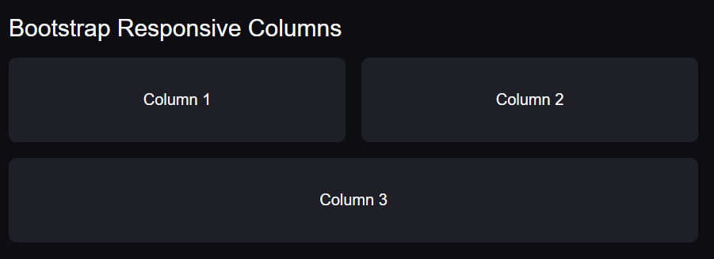

**Screenshot (mobile):**
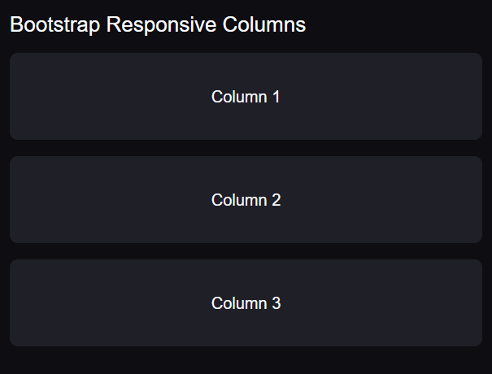

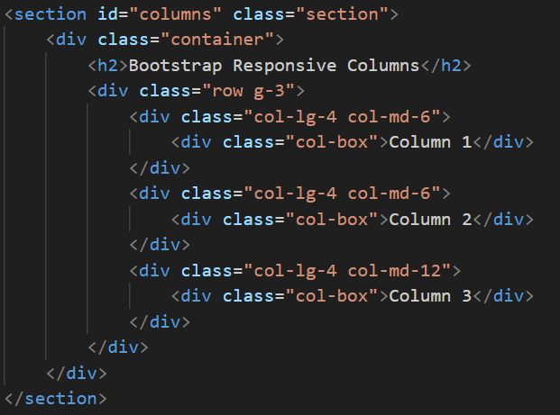
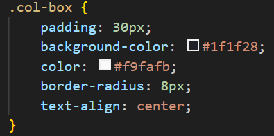

### Task 3: Bootstrap Navigation Bar

Bootstrap navbar with `navbar-expand-lg` so it collapses into a hamburger menu below 992px. The logo (`navbar-brand`) sits on the left and the links (`navbar-nav ms-auto`) go to the right. The toggler button uses `data-bs-toggle="collapse"` with `data-bs-target="#mainNav"` to open and close the menu.

**Screenshot (desktop):**

**Screenshot (mobile, menu open):**

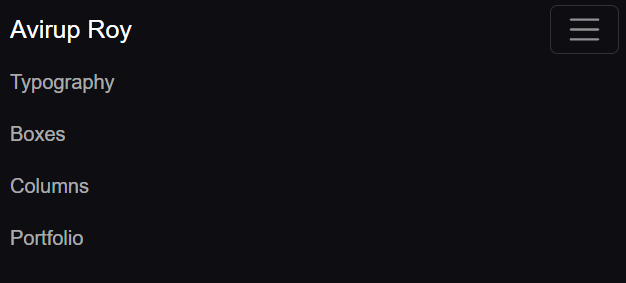

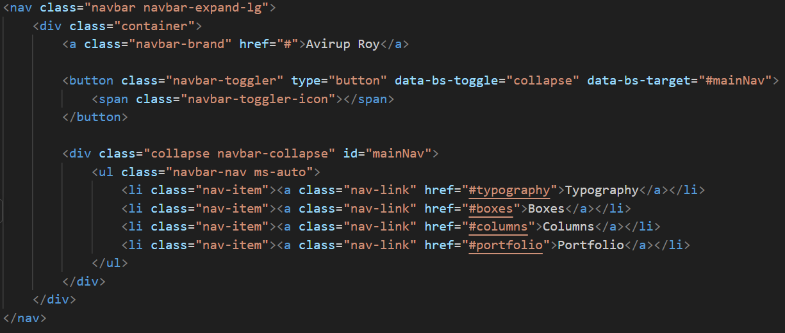

---

## Part 3: Combined Project

### Task 4: Responsive Portfolio Page

The portfolio section uses the same Bootstrap navbar as the header, then a Bootstrap row split into `col-lg-8` for projects and `col-lg-4` for the sidebar. Inside the projects column, a nested Bootstrap row uses `col-md-6` so two project cards sit per row on tablet and up. The sidebar contains personal info and contact details, plus an "Extra Info" block that is hidden on mobile using a custom media query. The whole page also has custom media queries adjusting font sizes at each breakpoint.

**Screenshot (desktop):**

**Screenshot (mobile):**
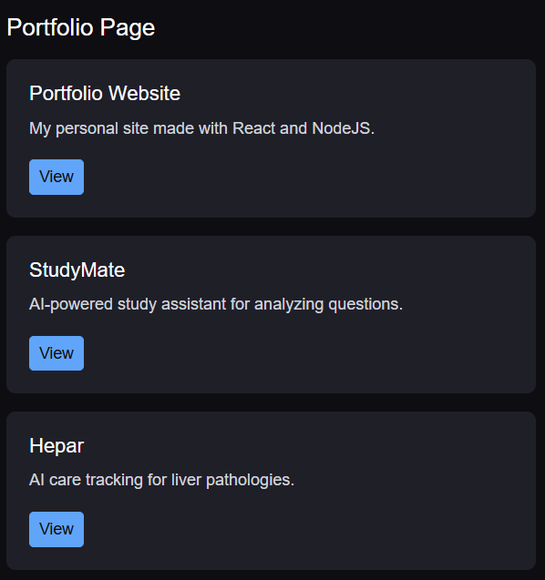

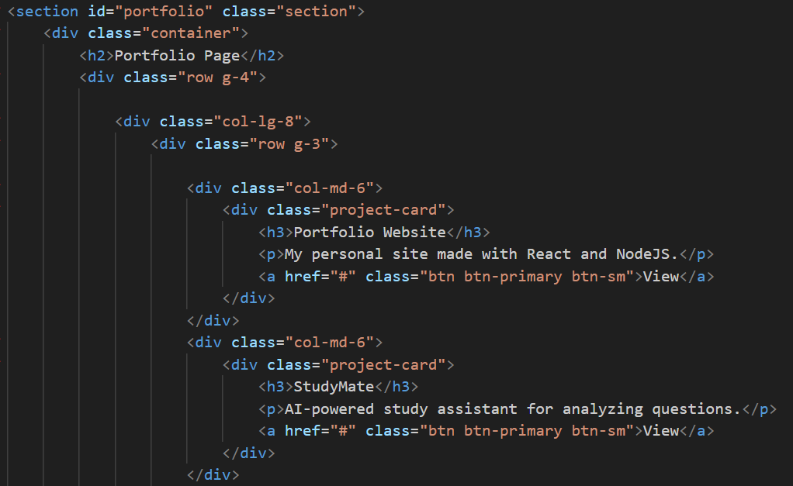
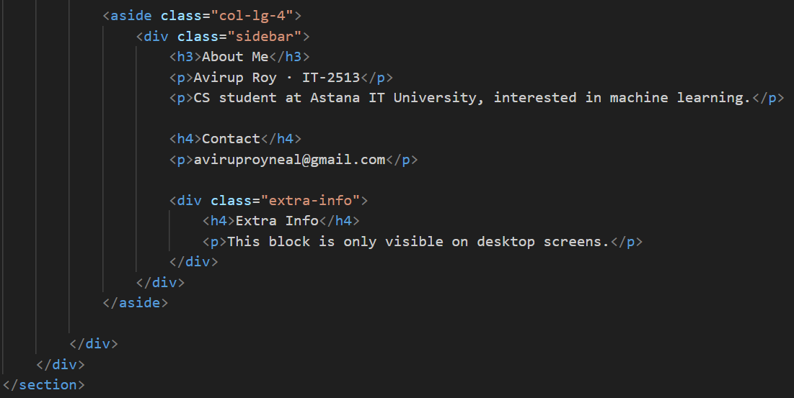
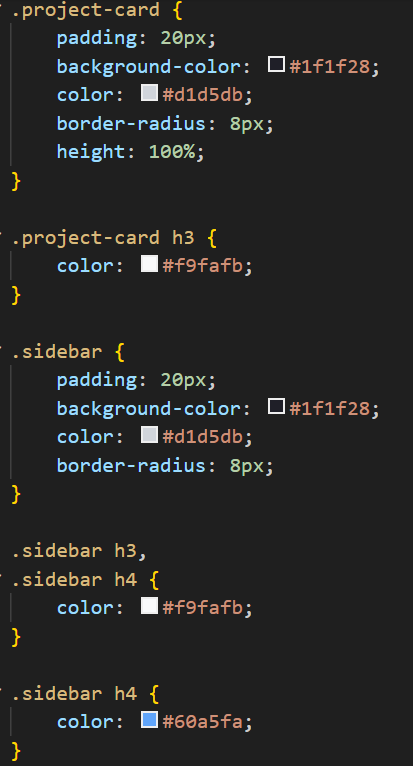
---

## Summary

The main thing I learned here was mobile-first thinking. Instead of designing for desktop and shrinking down, I wrote the base styles for mobile and used `min-width` media queries to add complexity as the screen gets wider. That matches how Bootstrap works too, its `col-*` classes are also mobile-first.

The Bootstrap grid uses a 12-column system, so `col-lg-4` means "4 out of 12 on large screens" (which is one third). Combining `col-lg-4 col-md-6` on the same element lets it change size at different breakpoints without any custom CSS.

The trickiest part was the navbar. It needs three specific things to work — `navbar-expand-lg` on the nav, a `navbar-toggler` button with `data-bs-target`, and a collapsible div with a matching `id`. Also, Bootstrap's JavaScript bundle needs to be loaded at the end of the body, otherwise the hamburger doesn't toggle.

The `meta viewport` tag in the head was also important — without it, mobile browsers render the page at a desktop width and scale everything down.

---
